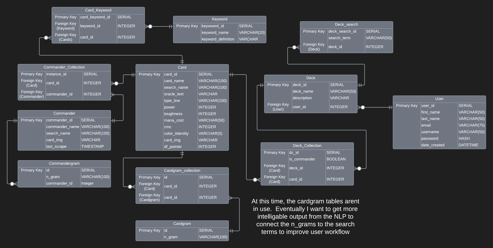

# CommanderGrams Backend
#### Hosted on Render
This project contains the Flask/PostgreSQL app that has the Database Language (SQLAlchemy), API, and Processing module that runs 'CommanderGrams' (hosted on netlify).  The web scraping portion of the Commander update is in a [separate project here](https://github.com/robertblindt/CommanderGrams-Scraper), and the [Frontend Project is here](https://github.com/robertblindt/CommanderGrams-Frontend).

#### Full App Running at: https://commandergrams.netlify.app/

## Installation
This repository is hosted on Render.com.  Although there is a very basic frontend embedded in this project, it is not intended to be used unless you are running locally to update routes.  If you would like to run this locally, there are 2 ways:
#### Run with Docker:
There is a Dockerfile in this repository from when I was intending to host the entirety of the backend on AWS.  As a result, there are still unnecessary parts of the docker image (Chrome and the selenium webdriver), but it should at least work quickly!
**Clone this repository, then add the file ```.env``` to the root directory.  In that file, paste in:**
```
FLASK_RUN_HOST="0.0.0.0"
```
This reroutes the flask app to run on the internal port for the docker container. 
*(Note: The hosted app runs with Gunicorn, but I am on Windows so I can't run Gunicron locally)*

**If you would like to work with a hosted Postgres database, create your hosted link and then paste it into the same ```.env``` under the name:**
```
DATABASE_URL = '{postgress_link}'
```
*(Note: If you skip this step, it will just create a SQLite database in your root)*

If you wanted to host this app yourself, you would have to also move the secret key around, but for personal use, it shouldn't matter.

**With Docker already installed on your system run:**
```
docker build -t cgram_backend:1.0 .
docker run -p 5000:5000 cgram_backend:1.0
```
At this point, you should be able to run the backend locally!

#### Run without Docker:
Clone this repository, then create a virtual environment.  There are items that can go in the ```.env```, but for local use, it does not matter (see above comments in the Docker usage).  The two things you may want in there are SECRET-KEY, and DATABASE_URL if you want to use Postgres.  

**Install all the required python packages using:**
```
pip install -r requirements.txt
```
**From there you should be able to just run:**
```
flask --debug run
```
and have the backend functional.

#### Connection Notes:
If you want to run the whole app locally, you will need to change the base API url in the React frontend app.  Since removing the scraper from this project, I have not tried to run the scraper on a local app, but it is using the python requests package to speak to this API.  I think you can use that package to talk to another internal port, but you will have to mess around with the porting to get 2 flask apps running at once and talking over 'requests'.  (The scraper works fine when this API is hosted though)


## Project Overview
This was a delve into creating a CRUD application, and working with a full stack project.
- Used Flask, PostgreSQL, and React
    - Used the return of scraped pages to retrieve data from an API.
    - Processed and stored data in order to analyze collections of text in a SQL database
    - Used Sklearn, Spacy, and Regex to clean and analyze the meaningful data.
    - Used React to create and log users, create decks, and show card data and the results of analysis

### Database Desgin:

Magic the Gathering cards are a little messy as data goes.  There are a variety of different 'card formats', and as a result, turning it into a relational database was a little tough.  In order to handle some of these oddities I added pointer columns and moved towards normalizing and flattening my tables.  There are some exceptions like the duplication of `card_img` in the commander table, and the use of `search-name` matching, but I intend to go back through to remove some redundancies once I work out some of the multi-table join in SQLAlchemy.

### Methodology:
The initial plan for this app was to scrape data for users live, but that was far too slow and selenium can be a little glitchy at times.  As a result, I will be scraping and processing data in the background as an administrative task, and serving up the data I have to users.

The exact explanation of where data is being pulled from, and how it is being given back to the user is in the parent [README]() to this.

## Future Improvements
- Fix multi-face card retrieval
    - Right now for deck builder, it isn't showing oracle text.  Need to modularize the doubleface card insert to be able to use it to retrieve cards

- Refine the NLP search methodology
    - As I build the collections DB, TF-IDF might be good to do to remove some of the nonsense.

- Integrate Keywords into the corpus
    - Currently no easy way to automate inserting the rules text associated with keywords.  
    - Need to parse official rules text (WOTC's online version is not easily parsed) or find a database that has the rules text printed on the card.

- Improve Deck Dump Instructions
    - must be in format '#x CARDNAME'

- Update 'term count' feature in deck builder
    - Using the output of count vectorization for commander or all cards
        - Without better filtering for n-grams, this isn't the most effient or useful way to treat and store the data right now.  Maybe after looking at TF-IDF results, we could store the data.

- Explore relating the bodies to create a model that allows for a new, unplayed, card to be input, and a system of search terms be returned.

- Add 'Recent Decks' to the front page.
    - On the same vein, right now you can only see the decks of the person who is logged in.
        - Altering the token auth, and handling the search bar and buttons with a boolean associated with `localStorage.getItem('token') == current_deck_id` (current_deck_id is not the actual variable)
    - Add a 'Private' column in decks to allow people not to report their decks publicly

